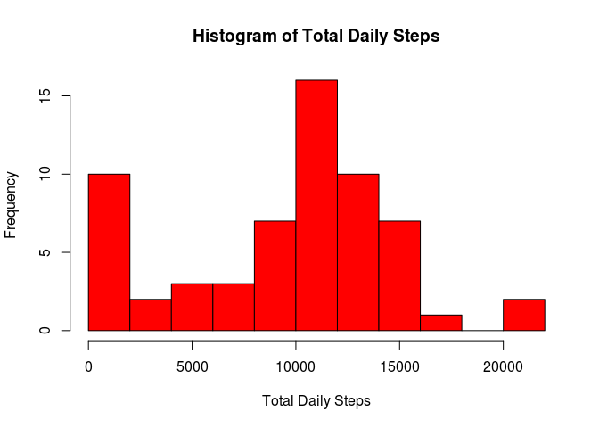
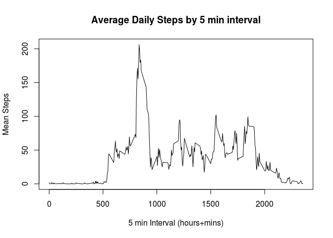
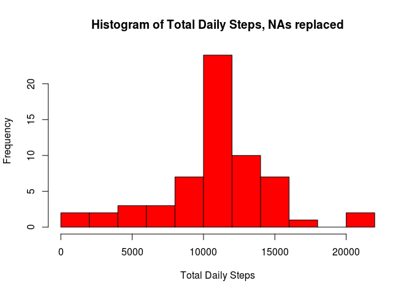
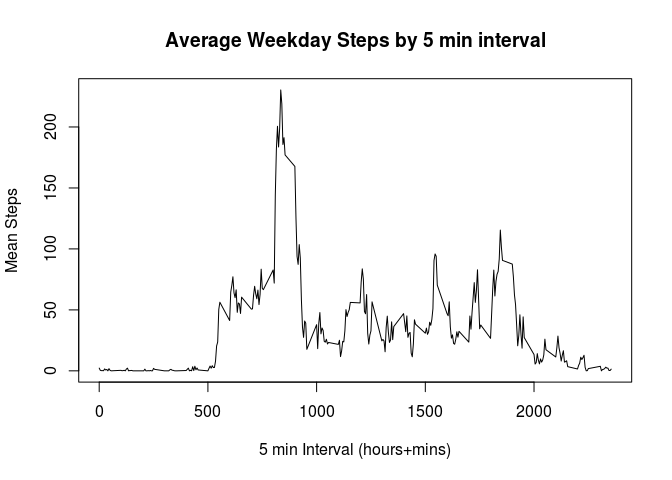
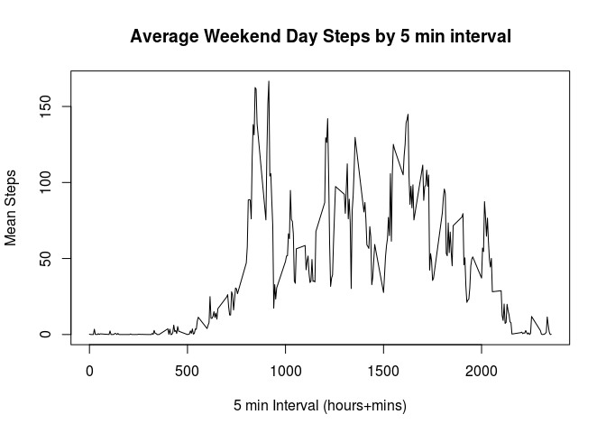

# Reproducible Research: Peer Assessment 1

setwd("~/github/RepData_PeerAssessment1")

## Loading and preprocessing the data
Download the archive from the Coursera website link, and unzip and load the data into R.
Export the raw data to a csv file.

The file was downloaded from: https://d396qusza40orc.cloudfront.net/repdata%2Fdata%2Factivity.zip at:

```r
Sys.Date()
```

```
## [1] "2016-03-18"
```


```r
temp <- tempfile()
download.file("https://d396qusza40orc.cloudfront.net/repdata%2Fdata%2Factivity.zip",temp)
activity_data <- read.csv(unz(temp, "activity.csv"),stringsAsFactors = FALSE)
unlink(temp)
write.csv(activity_data,"activity_data_raw.csv")
```

Convert dates in the dataset.  Then categorize each day as a weekday or weekend day.


```r
activity_data$date <- as.Date(activity_data$date, "%Y-%m-%d")
library(chron)
activity_data$day <- ifelse(is.weekend(activity_data$date), "Weekend", "Weekday")
activity_data$day <- as.factor(activity_data$day)
```

Verify that the data frame structure is correct:

```r
str(activity_data)
```

```
## 'data.frame':	17568 obs. of  4 variables:
##  $ steps   : int  NA NA NA NA NA NA NA NA NA NA ...
##  $ date    : Date, format: "2012-10-01" "2012-10-01" ...
##  $ interval: int  0 5 10 15 20 25 30 35 40 45 ...
##  $ day     : Factor w/ 2 levels "Weekday","Weekend": 1 1 1 1 1 1 1 1 1 1 ...
```

## What is mean total number of steps taken per day?
Calculate the mean and median steps per day.  Then plot a histogram of steps per day. NAs are removed for this analysis.


```r
library(dplyr)
```

```
## 
## Attaching package: 'dplyr'
```

```
## The following objects are masked from 'package:stats':
## 
##     filter, lag
```

```
## The following objects are masked from 'package:base':
## 
##     intersect, setdiff, setequal, union
```

```r
library(magrittr)
daily_steps_total <- activity_data %>% group_by(date) %>% summarise_each(funs(sum(steps, na.rm = TRUE)))
daily_steps_total <- daily_steps_total[,c(1,2)]
summary(daily_steps_total)
```

```
##       date                steps      
##  Min.   :2012-10-01   Min.   :    0  
##  1st Qu.:2012-10-16   1st Qu.: 6778  
##  Median :2012-10-31   Median :10395  
##  Mean   :2012-10-31   Mean   : 9354  
##  3rd Qu.:2012-11-15   3rd Qu.:12811  
##  Max.   :2012-11-30   Max.   :21194
```

```r
hist(daily_steps_total$steps, breaks=12, col="red",xlab="Total Daily Steps", 
  	main="Histogram of Total Daily Steps")
```



## What is the average daily activity pattern?
Calculate the average daily pattern by time interval, and then graph it.  NAs are removed.


```r
interval.steps <- activity_data %>% group_by(interval) %>% summarise_each(funs(mean(steps, na.rm = TRUE)))
interval.steps <- interval.steps[,c(1,2)]
plot(interval.steps$interval, interval.steps$steps, type="l", main="Average Daily Steps by 5 min interval", xlab = "5 min Interval (hours+mins)", ylab = "Mean Steps")
```



## Imputing missing values
How many NAs are there?  Replace NAs with mean steps/interval.  How is the replaced dataset different?

```r
summary(activity_data)
```

```
##      steps             date               interval           day       
##  Min.   :  0.00   Min.   :2012-10-01   Min.   :   0.0   Weekday:12960  
##  1st Qu.:  0.00   1st Qu.:2012-10-16   1st Qu.: 588.8   Weekend: 4608  
##  Median :  0.00   Median :2012-10-31   Median :1177.5                  
##  Mean   : 37.38   Mean   :2012-10-31   Mean   :1177.5                  
##  3rd Qu.: 12.00   3rd Qu.:2012-11-15   3rd Qu.:1766.2                  
##  Max.   :806.00   Max.   :2012-11-30   Max.   :2355.0                  
##  NA's   :2304
```

```r
impute.mean <- function(x) replace(x, is.na(x), mean(x, na.rm = TRUE))
activity_data.adj <- activity_data %>%
    group_by(interval) %>%
    mutate(
        steps = impute.mean(steps)
    )
summary(activity_data.adj)
```

```
##      steps             date               interval           day       
##  Min.   :  0.00   Min.   :2012-10-01   Min.   :   0.0   Weekday:12960  
##  1st Qu.:  0.00   1st Qu.:2012-10-16   1st Qu.: 588.8   Weekend: 4608  
##  Median :  0.00   Median :2012-10-31   Median :1177.5                  
##  Mean   : 37.38   Mean   :2012-10-31   Mean   :1177.5                  
##  3rd Qu.: 27.00   3rd Qu.:2012-11-15   3rd Qu.:1766.2                  
##  Max.   :806.00   Max.   :2012-11-30   Max.   :2355.0
```

```r
write.csv(activity_data.adj,"activity data with NA replaced.csv")
daily_steps_total.adj <- activity_data.adj %>% group_by(date) %>% summarise_each(funs(sum(steps, na.rm = TRUE)))
daily_steps_total.adj <- daily_steps_total.adj[,c(1,2)]
summary(daily_steps_total.adj)
```

```
##       date                steps      
##  Min.   :2012-10-01   Min.   :   41  
##  1st Qu.:2012-10-16   1st Qu.: 9819  
##  Median :2012-10-31   Median :10766  
##  Mean   :2012-10-31   Mean   :10766  
##  3rd Qu.:2012-11-15   3rd Qu.:12811  
##  Max.   :2012-11-30   Max.   :21194
```

```r
hist(daily_steps_total.adj$steps, breaks=12, col="red",xlab="Total Daily Steps", 
  	main="Histogram of Total Daily Steps, NAs replaced")
```



```r
replaced1 <- c(mean(daily_steps_total$steps, na.rm = TRUE), mean(daily_steps_total.adj$steps))
replaced2 <- c(median(daily_steps_total$steps, na.rm = TRUE), median(daily_steps_total.adj$steps, na.rm=TRUE))
replacement <- rbind(replaced1,replaced2)
rm(replaced1)
rm(replaced2)
rownames(replacement) <- c("mean steps","median steps")
colnames(replacement) <- c("NAs Removed", "NAs Replaced")
replacement
```

```
##              NAs Removed NAs Replaced
## mean steps       9354.23     10766.19
## median steps    10395.00     10766.19
```

## Are there differences in activity patterns between weekdays and weekends?
Subset data into weekend and weekday tables.  This is using the NAs replaced dataset.  Then average weekday/weekend activities are graphed.

```r
weekend_activity.adj <- activity_data.adj[which(activity_data.adj$day == "Weekend"),]
weekday_activity.adj <- activity_data.adj[which(activity_data.adj$day == "Weekday"),]

interval.steps_weekday <- weekday_activity.adj %>% group_by(interval) %>% summarise_each(funs(mean(steps, na.rm = TRUE)))
interval.steps_weekday <- interval.steps_weekday[,c(1,2)]
plot(interval.steps_weekday$interval, interval.steps_weekday$steps, type="l", main="Average Weekday Steps by 5 min interval", xlab = "5 min Interval (hours+mins)", ylab = "Mean Steps")
```



```r
summary(weekday_activity.adj)
```

```
##      steps             date               interval           day       
##  Min.   :  0.00   Min.   :2012-10-01   Min.   :   0.0   Weekday:12960  
##  1st Qu.:  0.00   1st Qu.:2012-10-16   1st Qu.: 588.8   Weekend:    0  
##  Median :  0.00   Median :2012-10-31   Median :1177.5                  
##  Mean   : 35.61   Mean   :2012-10-31   Mean   :1177.5                  
##  3rd Qu.: 24.00   3rd Qu.:2012-11-15   3rd Qu.:1766.2                  
##  Max.   :806.00   Max.   :2012-11-30   Max.   :2355.0
```

```r
interval.steps_weekend <- weekend_activity.adj %>% group_by(interval) %>% summarise_each(funs(mean(steps, na.rm = TRUE)))
interval.steps_weekend <- interval.steps_weekend[,c(1,2)]
plot(interval.steps_weekend$interval, interval.steps_weekend$steps, type="l", main="Average Weekend Day Steps by 5 min interval", xlab = "5 min Interval (hours+mins)", ylab = "Mean Steps")
```



```r
summary(weekend_activity.adj)
```

```
##      steps             date               interval           day      
##  Min.   :  0.00   Min.   :2012-10-06   Min.   :   0.0   Weekday:   0  
##  1st Qu.:  0.00   1st Qu.:2012-10-18   1st Qu.: 588.8   Weekend:4608  
##  Median :  0.00   Median :2012-10-31   Median :1177.5                 
##  Mean   : 42.37   Mean   :2012-10-31   Mean   :1177.5                 
##  3rd Qu.: 35.47   3rd Qu.:2012-11-12   3rd Qu.:1766.2                 
##  Max.   :785.00   Max.   :2012-11-25   Max.   :2355.0
```
It would appear that although the peak steps occurs around the same time for weekdays and weekends, that there is a generally higher level of steps throughout the rest of the day for weekend days in this dataset.
